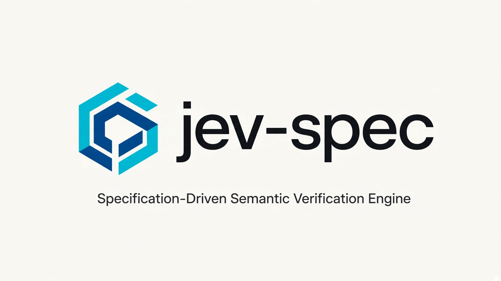

# jev-spec

[](https://www.npmjs.com/package/jev-spec)
[](https://github.com/nozomi-koborinai/jev-spec/actions/workflows/ci.yml)
[](https://nodejs.org/)
[](https://bun.sh/)
[](./LICENSE)

<p align="center"></p>

🌐 [English](README.md) | [简体中文](README.zh.md) | [한국어](README.ko.md)

**TypeSafe AI Jev を基盤とした、AI コードおよび仕様書のための仕様駆動セマンティック検証エンジン**

---

## なぜ jev-spec なのか？ セマンティックギャップの解消

仕様駆動開発（SDD: Specification-Driven Development）や AI コーディングツール（Cursor、エージェント型コーディング環境、GitHub Copilot）を用いたワークフローにおいて、構文リンターは Markdown の構造、見出しの階層関係、相互参照、要件 ID などを決定論的に検証します。しかし、静的リンターではコードと仕様の間の **セマンティックギャップ（意味的乖離）** を埋めることはできません。

- *`src/auth/session.ts` は、`REQ-AUTH-02` で規定された機能要件を真に満たしているか？*
- *AI アシスタントが、指示されていない副作用、バイパスヘッダー、あるいは仕様外のエンドポイントを密かに混入させていないか？*
- *このプルリクエストは要件を満たした完全な実装なのか、それとも TODO コメントが残る楽観的なスタブなのか？*

### 自己回帰型 LLM の落とし穴：検証における自由生成の限界

これまで、セマンティックな仕様適合性を評価するには、自己回帰型の生成言語モデルに対してプロンプトエンジニアリングを行う必要がありました。

- **高いレイテンシ**: トークンごとの逐次生成により、1 ファイルのレビューに **5〜15 秒** を要する。
- **過大なコスト**: 自己回帰デコードにより、1 ファイルの評価あたり **$0.05〜$0.20 以上** を消費する。
- **非決定論的なブレ**: 脆弱なプロンプトテンプレート、ハルシネーションによる理由付け、JSON パースエラー、実行ごとの主観的な揺らぎ。
- **ワークフローの摩擦**: 遅すぎるため、Git の pre-commit フックやステージングされた差分の検証、CI でのブロッキングゲートとしては実用的でない。

### Jev のアドバンテージ：自由テキスト生成を超える構造化決定プリミティブ

光学において、**コリメーター（collimator）** は拡散した光線を平行で集光された光束へと整流します。`jev-spec` はセマンティックなコリメーターとして機能します。すなわち、AI コーディングモデルによるエントロピーの高い拡散した出力を、数学校正された決定論的な検証判断へと収束させます。

**TypeSafe AI Jev** を基盤とする `jev-spec` は、トークン単位のテキスト生成ではなく、構造化決定プリミティブに基づいて構築されています。

- **構造化決定プリミティブ**: 自由形式の散文や JSON 文字列をトークン単位で逐次生成するのではなく、仕様コンテキストと実装コードから、型付けされた決定プリミティブ（`noul`、`choice`、`score`）に対する校正済み確率分布を単一フォワードパスで直接予測。
- **400ms 未満の超高速検証**: 単一フォワードパス評価により **70ms〜400ms** で完了。
- **圧倒的なコスト効率**: 入力トークン 100 万あたり **$0.042**（出力トークンは無料）。生成型プロンプトによるレビューと比較して 100 倍以上安価。
- **数学的キャリブレーション（数学校正）**: RLCD（Reinforcement Learning for Calibrated Decisions: 校正決定のための強化学習）によって訓練された型付き決定プリミティブを評価。予測確率 0.85 は、その命題が経験的に 85% のケースで真であることを意味します。
- **並列サンプラー**: ブール命題（`noul`）、カテゴリカル分布（`choice`）、順序尺度（`score`）を、共有された仕様とコードのコンテキストに対して単一フォワードパスで同時に評価。
- **決定論的な数値アサーション**: セマンティックアサーション（`minProbability`、`maxProbability`、`allowedChoices`、`minScore`）を、標準終了コードとともにターミナル、pre-commit フック、または CI パイプラインで直接テスト可能。

| 項目 | 自己回帰型 LLM プロンプト | jev-spec + Jev（決定プリミティブ） |
| :--- | :--- | :--- |
| **実行速度** | 1 ファイルあたり 5,000ms〜15,000ms | **70ms〜400ms**（単一フォワードパス） |
| **トークン費用** | 約 $3.00〜$15.00 / MTok | **$0.042 / MTok**（出力トークン無料） |
| **評価方式** | トークン単位の自由文 / JSON 逐次生成 | **型付き決定プリミティブに対する単一フォワードパス** |
| **出力形式** | 非構造化散文またはパースされた JSON 文字列 | **校正済み確率分布 & カテゴリカル分布** |
| **決定論性** | 主観的な推論とフォーマットのブレ | **数値しきい値（`minProbability: 0.85` 等）** |
| **Git フック & 高速 CI** | 実用困難（開発フローを阻害） | **即座に実行（Bun での起動 <100ms）** |

### アーキテクチャ概要

```text
仕様書 (Markdown / MDX) ────────┐
                               ├─► [jev-spec エンジン] ─► Jev System 1 ─► 校正された決定とアサーション
実装コード (Code / Git Diff) ───┘   (Root Jail + 境界隔離)                 (<400ms で Pass / Fail 判定)
```

1. **コンテキスト抽出**: `mdast` を用いて Markdown 仕様書をパースし（見出し、タグ、要件 ID でフィルタリング）、対象ソースファイルまたはステージングされた Git 差分ハンクを抽出。
2. **セキュリティ隔離**: ワークスペースの root jail（ルートディレクトリ外アクセスの防止）、シンボリックリンク脱出の検出、Git リビジョン引数のサニタイズ、プロンプトインジェクション防御のための境界タギングを適用。
3. **並列フォワードパス**: 共有コンテキストと評価基準（ルーブリック）を単一バッチリクエストとして Jev 決定エンジンへ送信。
4. **アサーション評価**: 返却された校正済み確率とスコアを数値しきい値と照合し、CI/CD 自動化に適した決定論的終了コードで終了。

---

## クイックスタート

**AI によるセットアップ。** Claude Code、Cursor、Codex、Gemini CLI、GitHub Copilot など、[Agent Skills](https://agentskills.io) 対応のクライアント向けです（GitHub CLI v2.90 以降が必要）。

```bash
gh skill install nozomi-koborinai/jev-spec jev-spec-init
gh skill install nozomi-koborinai/jev-spec jev-spec-fix
```

そのうえでエージェントに「jev-spec をセットアップして」と依頼してください。`jev-spec-init` は仕様書とコードの対応付けを行い、要件ごとに焦点を絞った質問を 1 つずつ書き、オフラインで配線を検証して、カバーされていない要件を報告します。`jev-spec-fix` は失敗したチェックの原因を切り分け、何が検証され何が検証されていないかを報告します。

**手動セットアップ。** 以下の 3 ステップですぐに `jev-spec` を導入できます。

### 1. jev-spec のインストール

お好みのパッケージマネージャーで開発用依存関係としてインストールします。

```bash
# Bun（ローカルの開発ループに推奨）
bun add -d jev-spec

# npm
npm install -D jev-spec

# pnpm
pnpm add -D jev-spec
```

*ローカルインストールを行わずに、`bunx jev-spec` または `npx jev-spec` で直接実行することも可能です。*

### 2. ゾーンとルーブリックの設定

リポジトリルートに `jev-spec.config.ts` を作成します。

```typescript
import { defineConfig, noul, choice, score } from 'jev-spec';

export default defineConfig({
  zones: {
    auth: {
      description: 'Authentication session token verification',
      specPath: 'docs/specs/auth-requirements.md',
      codePaths: ['src/auth/**/*.ts', '!src/auth/**/*.test.ts'],
      specFilter: {
        requirementPrefix: 'REQ-AUTH-',
      },
      rubrics: {
        verifiesSessionTokens: noul(
          'Does the code satisfy REQ-AUTH-01: the signature of every session token is verified before access to a protected resource is granted?'
        ),
        rejectsRevokedTokens: noul(
          'Does the code satisfy REQ-AUTH-02: a token whose ID is on the revocation list is rejected?'
        ),
        introducesUnspecifiedBehavior: noul(
          'Does the implementation introduce undocumented endpoints, global state mutability, or unauthenticated bypasses?'
        ),
        securityPosture: choice('Security posture of session management', {
          secure: 'Proper signature validation and revocation checks present',
          insecure: 'Missing verification, weak crypto, or tokens logged',
        }),
        implementationCompleteness: score('Degree of completeness', [
          'Stub: Empty function signatures or TODO comments',
          'Partial: Happy path implemented, error handling missing',
          'Feature Complete: Complete implementation meeting all criteria',
        ]),
      },
      assertions: {
        verifiesSessionTokens: { minProbability: 0.85 },
        rejectsRevokedTokens: { minProbability: 0.85 },
        introducesUnspecifiedBehavior: { maxProbability: 0.15 },
        securityPosture: { allowedChoices: ['secure'], minConfidence: 0.75 },
        implementationCompleteness: { minScore: 1.8 },
      },
    },
  },
});
```

質問は要件ごとに 1 つずつ、要件 ID を明記して書いてください。複数の要件を 1 つの質問にまとめると、どの要件で失敗したのか分からなくなり、モデルの回答の信頼性も下がります。

### 3. セマンティック検証の実行

API キーを設定して検証コマンドを実行します。

```bash
export TYPESAFE_AI_API_KEY="your-typesafe-api-key"

# Bun による高速実行
bunx jev-spec check

# Node.js npx による実行
npx jev-spec check
```

*(補足: まだ API キーが無い場合は、`jev-spec check --dry-run` で設定・仕様のパース・ファイルのマッチングを検証できます。何も評価しません。`--mock` はオフラインのモック評価器を実行します。その結果はプレースホルダであり、すべてのレポートに `MOCK MODE` と明示されます)*

---

## 設定 DSL ガイド

`jev-spec` の設定では、完全な TypeScript の型推論とオートコンプリートを提供する `defineConfig(...)` ヘルパーを使用します。

設定は、Jev へ何かを送信する前に必ず検証されます。どのルーブリックにも一致しないアサーションのキー、ルーブリックの型に合わないオプション、存在しない選択肢のキー、範囲外のしきい値（たとえば `0.15` のつもりで `maxProbability: 15` と書いた場合）があると、決して失敗しないチェックを黙って作ってしまう代わりに、終了コード `2` で実行を止めます。`defineConfig(...)` を使っていれば、同じ誤りを TypeScript がエディタ上で指摘します。

### コア DSL プリミティブ

#### noul(question): NoulRubric

**noul** は、`[0, 1]` の範囲で評価される校正済みブール命題です。Jev は、仕様コンテキストと実装コードを踏まえて、その記述が真である経験的確率を推定します。

```typescript
rubrics: {
  implementsRateLimit: noul('Does the rate limiter enforce a 60 req/min bucket?'),
  hasBypassHeader: noul('Does the implementation permit any unauthenticated bypass header?'),
},
assertions: {
  implementsRateLimit: { minProbability: 0.85 },
  hasBypassHeader: { maxProbability: 0.10 },
}
```

- **アサーションオプション**:
  - `minProbability?: number`: 許容される最小確率しきい値（`[0, 1]`）。
  - `maxProbability?: number`: 許容される最大確率しきい値（`[0, 1]`）。

#### choice(description, options): ChoiceRubric

**choice** ルーブリックは、相互排他的な選択肢にわたる離散的なカテゴリカル分布を表します。

```typescript
rubrics: {
  architecturePattern: choice('Architectural pattern applied', {
    hexagonal: 'Domain logic isolated with ports and adapters',
    layered: 'Classic controller-service-repository layered pattern',
    spaghetti: 'Tightly coupled concerns without distinct abstraction boundaries',
  }),
},
assertions: {
  architecturePattern: {
    allowedChoices: ['hexagonal', 'layered'],
    blockedChoices: ['spaghetti'],
    minConfidence: 0.80,
  },
}
```

- **アサーションオプション**:
  - `allowedChoices?: readonly T[]`: 許可する選択肢キーの配列。
  - `blockedChoices?: readonly T[]`: 禁止する選択肢キーの配列（選択された場合に失敗）。
  - `minConfidence?: number`: 選択された選択肢に要求される最小信頼度スコア（`[0, 1]`）。

#### score(description, levels): ScoreRubric

**score** ルーブリックは、2〜10 レベルの順序尺度に対して評価を行います。連続的なスコア値、各レベルの確率、および信頼度を返します。

```typescript
rubrics: {
  implementationCompleteness: score('Implementation depth relative to specification', [
    'Stub: Function signatures with empty bodies or TODO comments',
    'Partial: Happy path implemented, error handling or edge cases missing',
    'Feature Complete: Happy path and error branches fully handled',
    'Production Ready: Complete implementation with validation and defensive bounds',
  ]),
},
assertions: {
  implementationCompleteness: {
    minScore: 2.0, // 最小小数スコアインデックス（0 = Stub、3 = Production Ready）
    minConfidence: 0.70,
  },
}
```

- **アサーションオプション**:
  - `minScore?: number`: 最小小数スコアインデックス。
  - `maxScore?: number`: 最大小数スコアインデックス。
  - `minConfidence?: number`: 最小信頼度指標（`[0, 1]`）。

### ゾーン設定インターフェース

```typescript
export interface ZoneConfig {
  /** ゾーンの概要説明（任意） */
  readonly description?: string;

  /** ワークスペース内の Markdown / MDX 仕様書への相対パス */
  readonly specPath: string;

  /** 対象実装ファイルの相対パスまたは glob パターン */
  readonly codePaths: readonly string[];

  /** 仕様書のセクション抽出フィルタリングルール */
  readonly specFilter?: {
    readonly headings?: readonly string[];       // 見出しタイトルによるフィルタ
    readonly requirementPrefix?: string;         // 例: 'REQ-AUTH-' や 'AC-'
    readonly tags?: readonly string[];           // ハッシュタグによるフィルタ（例: ['auth']）
  };

  /** 宣言された Jev 評価ルーブリック */
  readonly rubrics: Record<string, AnyRubric>;

  /** Jev の評価結果と照合するアサーション */
  readonly assertions: AssertionMap<R>;
}
```

`specFilter` は、指定したすべての条件を満たすセクションを、その配下のサブセクションごと残します。より深い見出しの下に書かれた詳細も、要件の一部として保持されます。どのセクションにも一致しないフィルタは、文書全体を黙って送信する代わりに、設定エラー（終了コード `2`）として扱われます。

### CLI 利用リファレンス

#### すべてのゾーンを検証

設定内で宣言されたすべてのゾーンに対してセマンティック検証を実行します。

```bash
# Bun による即座のチェック
bunx jev-spec check

# Node.js によるチェック
npx jev-spec check
```

#### 特定ゾーンの指定検証

特定のゾーンのみを対象に検証を実行します。

```bash
bunx jev-spec check --zone auth
```

#### Git 差分による検証（Pre-commit フックおよび CI）

ソースファイル全体ではなく、変更された行のみを対象にセマンティック検証を実行します。

```bash
# ステージングされた Git 変更に対して検証（pre-commit フックに最適）
bunx jev-spec check --staged

# ブランチ範囲の Git 差分に対して検証（PR の CI に最適）
bunx jev-spec check --diff origin/main...HEAD
```

変更されたファイルが `codePaths` に 1 つも一致しないゾーンは `SKIPPED` として報告されます。Jev には送信されず、終了コードにも影響しないため、ゾーンに触れていないコミットを pre-commit フックが止めることはありません。

#### ドライラン・Mock モード・ヘルプ・バージョン

```bash
# セットアップの検証: 設定、仕様のパース、ファイルのマッチング。何も評価せず、API キーも不要
npx jev-spec check --dry-run

# オフラインのモック評価器（結果はプレースホルダで、すべてのレポートに MOCK MODE と表示）
npx jev-spec check --mock

# 使い方とバージョン（設定ファイルは不要）
npx jev-spec --help
npx jev-spec --version
```

ドライランは、ゾーンごとに、見つかった仕様のセクションと要件 ID、マッチしたコードファイル、問い合わせる予定のルーブリック、見積もりコストを表示します。どのルーブリックにも言及されていない要件 ID、どのファイルにも一致しない `codePaths`、サイズ上限を超えるコードコンテキストについては警告します。セットアップが正しければ終了コード `0`、不備があれば `2` で終了します。何も検証しないため、`1` で終了することはありません。

不明なコマンド、不明なオプション、値の欠けたオプション、未対応の `--format` 値は、終了コード `2` で拒否されます。

#### 出力フォーマットの指定

```bash
# 整形されたターミナルレポート（デフォルト）
npx jev-spec check --format terminal

# Markdown レポート（GitHub Step Summary や PR コメントに最適）
npx jev-spec check --format markdown --output jev-spec-report.md

# 機械可読な JSON 出力（カスタム集計パイプライン用）
npx jev-spec check --format json --output result.json
```

`--output` に指定できるのはプロジェクトルート内のパスだけです。GitHub Actions の Step Summary（ワークスペースの外にあります）へ出力する場合は、標準出力をリダイレクトしてください。

```bash
npx jev-spec check --format markdown >> "$GITHUB_STEP_SUMMARY"
```

#### CLI 終了コード

- `0`: すべてのゾーンおよびアサーションに合格。
- `1`: 検証失敗（1 つ以上のアサーションに違反）。
- `2`: 設定または実行時エラー（ファイル不在、不正な引数、API キー欠落など）。

---

## デュアルランタイム対応マトリクス

`jev-spec` は、モダンな **Node.js** および **Bun** の両方に対してファーストクラスのデュアルランタイムサポートを提供します。すべてのプルリクエストは、自動 CI によりサポート対象の全バージョンで両ランタイムに対して検証されています。

| ランタイム | サポートバージョン | ステータス | 最適なユースケース | 典型的なコールドスタート |
| :--- | :--- | :--- | :--- | :--- |
| **Bun** | `>= 1.2`（最新） | Tier 1 / フルサポート | 超高速 pre-commit フック、ステージング差分チェック、ローカル開発ループ | **< 100ms** |
| **Node.js** | `>= 22.0.0`（LTS 22） | Tier 1 / フルサポート | 標準的な本番 CI/CD パイプライン、コンテナ環境 | 約 350ms〜500ms |
| **Node.js** | `>= 24.0.0`（Current 24） | Tier 1 / フルサポート | 最先端の Node ランタイム環境 | 約 350ms〜500ms |

### なぜ Pre-Commit フックに Bun が適しているのか？

Jev は判定を **1 秒未満（70ms〜400ms）** で評価するため、ローカル開発フローにおける経過時間の大部分はランタイムの起動オーバーヘッドが占めることになります。

- **即時実行**: `bunx jev-spec check --staged` は **100ms 未満** で起動し、従来のランナー起動と比べて 3 倍以上高速です。
- **摩擦のない Git フック**: 開発者はステージングされた変更に対する完全なセマンティックアサーションを合計 0.5 秒未満で実行できます。
- **ネイティブ TypeScript 実行**: トランスパイルオーバーヘッドなしに `jev-spec.config.ts` を直接読み込みます。

---

## セキュリティと CI ベストプラクティス

`jev-spec` は、自動化された CI/CD 環境および開発者のワークステーションで安全に実行できるように設計されています。

### CI 脅威モデル：Fork PR とシークレットの取り扱い

> [!WARNING]
> パブリックリポジトリの外部プルリクエスト（`pull_request` イベント）に対して、`TYPESAFE_AI_API_KEY` を絶対に公開しないでください！

1. **信頼できないコードのリスク**: パブリックリポジトリでは、PR によって `jev-spec.config.ts`、仕様書、コードが改ざんされる可能性があります。機密性の高い認証情報へのアクセス権を持った状態で信頼できないコードを実行すると、シークレット漏洩の攻撃対象領域となります。
2. **推奨される多層防御パターン**:
   - **Fork PR にはドライランを使用**: PR チェックではドライラン（`jev-spec check --dry-run`）を使用し、API 認証情報を一切公開せずに設定構造、仕様パース、glob パターンの一致を検証します。
   - **Environment Protection（環境保護ルール）**: 外部 PR でライブ検証を行う場合は、GitHub Actions の Environment Approvals を使用し、メンテナーが差分を確認・承認した後にのみシークレットが利用できるようにします。
   - **main ブランチでの検証**: `main` への push や信頼できる内部リリースのブランチに対してライブのセマンティック検証を実行します。

### 推奨 GitHub Actions ワークフロー

```yaml
name: Specification Semantic Gate

on:
  pull_request:
    branches: [main]
  push:
    branches: [main]

permissions:
  contents: read

jobs:
  verify-specs:
    runs-on: ubuntu-latest
    steps:
      - name: Checkout Code
        uses: actions/checkout@v4
        with:
          fetch-depth: 0

      - name: Setup Node.js
        uses: actions/setup-node@v4
        with:
          node-version: 22
          cache: npm

      - name: Install Dependencies
        run: npm ci

      - name: Run jev-spec (Internal Pull Request / Changed Zones)
        if: github.event_name == 'pull_request' && github.event.pull_request.head.repo.full_name == github.repository
        env:
          TYPESAFE_AI_API_KEY: ${{ secrets.TYPESAFE_AI_API_KEY }}
        run: |
          npx jev-spec check \
            --diff origin/main...HEAD \
            --format markdown >> "$GITHUB_STEP_SUMMARY"

      - name: Run jev-spec (Push to Main / Full Verification)
        if: github.event_name == 'push'
        env:
          TYPESAFE_AI_API_KEY: ${{ secrets.TYPESAFE_AI_API_KEY }}
        run: npx jev-spec check --format markdown >> "$GITHUB_STEP_SUMMARY"

      - name: Run jev-spec (External Fork / Dry Run, No Secrets)
        if: github.event_name == 'pull_request' && github.event.pull_request.head.repo.full_name != github.repository
        run: npx jev-spec check --dry-run
```

push 時のステップは意図的にフル検証を実行します。`main` 上では `origin/main...HEAD` が空の範囲になり、すべてのゾーンがスキップされてしまうためです。

### 組み込みセキュリティ防御機能

`jev-spec` は、開発マシンと CI ランナーを保護するための包括的な多層防御セキュリティ機能（Hardening S-01〜S-05）を実装しています。

| セキュリティ対策 | 実装と保証内容 |
| :--- | :--- |
| **パストラバーサル & Root Jail** | ワークスペースパスは realpath 解決により厳密に検証されます（`assertInsideRoot()`）。カレント作業ディレクトリ外の絶対パス、`..` によるディレクトライバーサル、およびリポジトリルートを脱出するシンボリックリンクは拒否されます。 |
| **Git リビジョンのサニタイズ** | `--diff` に渡される引数は、厳格な Git リビジョン正規表現パターンで検証されます（`assertGitRevision()`）。`-` で始まるフラグ（`--output` などのオプションインジェクション）を拒否し、リビジョン範囲の直前に `--end-of-options` を置いてオプション解析を打ち切り、15 秒のコマンドタイムアウトを強制します。 |
| **プロンプト境界防御** | 信頼できない仕様書および実装コードの内容は、境界タグ（`<specification_context>` および `<untrusted_source_code>`）内に隔離されます。さらに、ソースファイル内に埋め込まれた指示を無視するよう Jev に指示するプロンプトインジェクション防御文脈が付与されます。 |
| **Base URL SSRF 防御** | デフォルトでは、リクエストは公式の TypeSafe AI エンドポイント（`https://api.typesafe.ai`）にのみルーティングされます。`allowCustomBaseUrl: true` が明示的に設定されていない限り、カスタム API ベース URL はブロックされます。 |
| **リソース制限** | 1 回のスキャンあたり最大 500 ファイル、ファイルサイズ上限 2MB、プロンプトごとの文字数切り詰めなど、厳格な上限を強制することで DoS や過度なメモリ消費を防止します。 |

詳細なセキュリティポリシーおよび脆弱性報告窓口については、[SECURITY.md](./SECURITY.md) を参照してください。

---

## コントリビューションとライセンス

コントリビューションを歓迎します。プルリクエストを提出する前に、すべてのテストとリンターチェックが合格することをご確認ください。

```bash
npm run check      # Biome（リントとフォーマット検査）、型チェック、テスト
npm run lint:fix   # Biome のフォーマットと安全なリント修正を適用
```

[MIT License](./LICENSE) のもとで公開されています。
